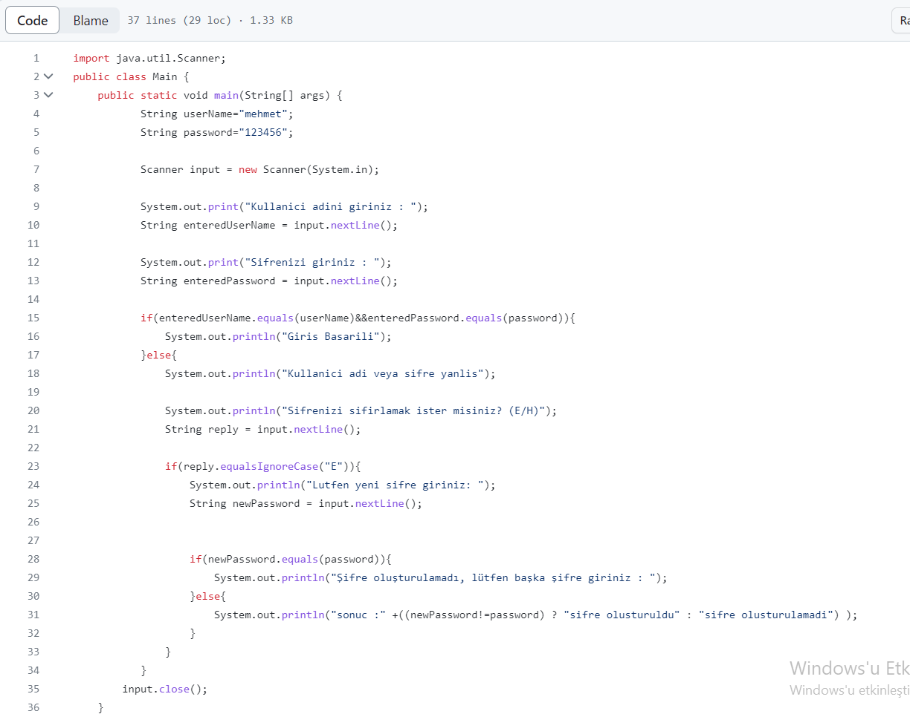

# ATM Ekrani
Kullanici dan veri alinarak sifre ve parola istenmektedir. Proje kullanicinin sifre ve parolasinin dogrulugunu kontrol etmektedir. Dogru olursa giris yapmasina izin vermektedir yanlis olursa sifre veya parolayi tekrar istemektedir.

### ProjeResmi

